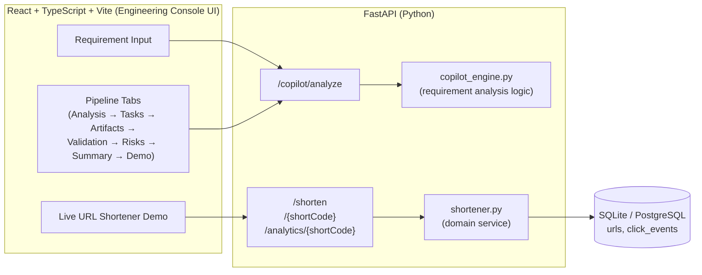
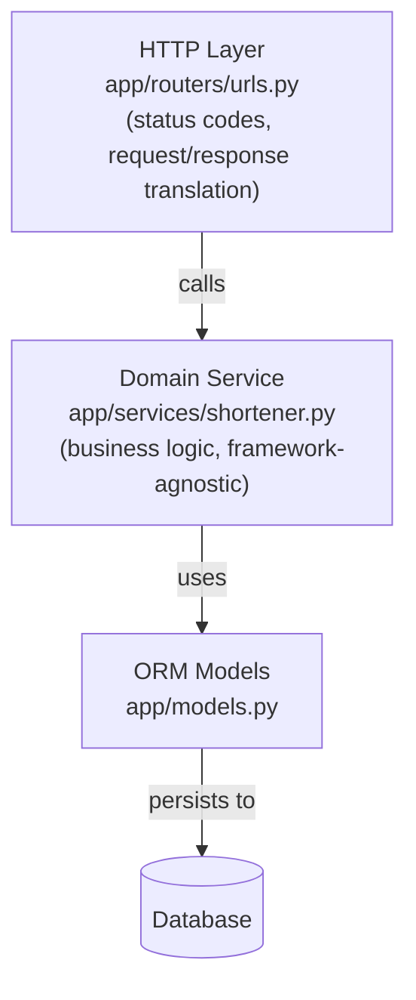
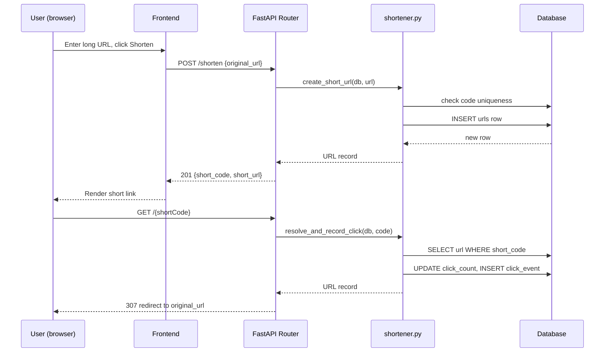

# Architecture Overview

## 1. What this system is

Two things live in one repository, on purpose:

1. **The Copilot Console** — the actual deliverable for this assignment. Given a
   free-text software requirement, it produces the structured engineer-led,
   AI-assisted breakdown the assignment asks for: requirement analysis, task
   decomposition, engineering artifacts, validation, risk analysis, and a
   final summary.
2. **The URL Shortener** — the mandatory use case, fully implemented and
   runnable, that the Copilot Console's URL-shortener analysis branch
   describes. It is not a mock — `POST /shorten`, `GET /{shortCode}`, and
   `GET /analytics/{shortCode}` are real, tested, working endpoints backed
   by a real database.

The Copilot Console's output for the URL shortener requirement is a
retrospective, engineer-authored account of how that service was actually
built with AI assistance — not a live call to a third-party LLM. See
`backend/app/services/copilot_engine.py`'s module docstring for the
reasoning behind that design decision (reliability, transparency,
extensibility — a real LLM call is a drop-in replacement behind the same
schema boundary).

## 2. System diagram



## 3. Layered design (URL shortener)



This is a straightforward layered/hexagonal-lite split:

- **Routers** only translate HTTP ⇄ domain calls. No business rules live here.
- **Services** hold all business logic and raise typed exceptions
  (`DuplicateAliasError`, `ShortCodeNotFoundError`, `ShortCodeGenerationError`)
  that routers translate into HTTP status codes. This means the service layer
  is fully unit-testable without an HTTP client or a running server.
- **Models** are thin SQLAlchemy declarations only.

This separation is what SOLID's Single Responsibility Principle looks like
in practice here, and it's why `test_unit_shortener.py` can test collision
handling and analytics aggregation without touching FastAPI at all.

## 4. Request flow — shorten & redirect



## 5. AI tool integration points

AI assistance was used at the **task** level, not as an autonomous agent
driving the whole project — consistent with the assignment's explicit
scope boundary ("not autonomous systems or workflow orchestration").
Concretely, across this repository:

| Task | AI was used for | Engineer validation performed |
|---|---|---|
| Schema design | Drafting initial SQLAlchemy models from a plain-English field list | Added the `click_events` table (AI's first draft only had a counter — insufficient for real analytics), added the unique index on `short_code` |
| Short-code generation | Drafting a random base62 generator | Found and fixed a missing DB-uniqueness check (AI's version could silently collide); added bounded retry + typed exception |
| API routes | Drafting route signatures/status codes | Corrected redirect status from AI's default 301 to 307 (see `schemas.py`/`ARCHITECTURE.md` assumptions); added explicit error paths AI omitted |
| Unit tests | Drafting initial happy-path test cases | Added collision, exhaustion, never-clicked, and unknown-code edge cases the AI draft didn't include |
| Integration tests | Drafting the shorten→redirect→analytics happy path | Added 409/404/422 negative-path coverage |
| Frontend components | Scaffolding component structure and Tailwind utility classes from a layout description | Refactored shared state into a single `App`-level fetch, split presentational components, fixed prop typing |
| Documentation | Drafting prose and initial Mermaid syntax | Corrected diagram edges to match the actually-implemented routes; verified rendering |

This table is intentionally specific rather than a generic "AI helped with
everything" claim — see `copilot_engine.py`'s `task_decomposition` output
for the same information surfaced live in the running application for the
URL-shortener requirement.

## 6. Key design decisions & trade-offs

| Decision | Rationale | Trade-off accepted |
|---|---|---|
| SQLite by default | Zero-setup for evaluators; `DATABASE_URL` env var swaps to PostgreSQL with no code change (SQLAlchemy abstracts the dialect) | Not suitable for high-concurrency production writes as-is |
| 307 redirect (not 301) | Short links may be repointed/expired in future iterations; 301 would be cached by browsers, defeating that flexibility | Marginally more redirect requests over time vs. a permanent redirect |
| Deterministic rule-based Copilot engine (not a live LLM call) | Reproducible, auditable output for evaluation; no external API dependency/failure mode | Less "creative"/adaptive than a live LLM; documented as a deliberate seam for future replacement |
| Separate `click_events` table, not just a counter | Enables real time-series analytics, matching what "analytics" plausibly means beyond a raw count | Slightly more write load per click (one INSERT + one UPDATE instead of one UPDATE) |
| No auth layer | Out of stated scope for this prototype; assignment focuses on AI-assisted engineering execution, not full production hardening | Both API groups are fully public — documented explicitly as a limitation, not hidden |

## 7. Folder structure

```
url-shortener-ai-copilot/
├── backend/
│   ├── app/
│   │   ├── main.py              # FastAPI app, CORS, router wiring, lifespan
│   │   ├── config.py             # Centralized env-driven configuration
│   │   ├── database.py           # SQLAlchemy engine/session/Base
│   │   ├── models.py             # ORM models: URL, ClickEvent
│   │   ├── schemas.py            # Pydantic request/response contracts
│   │   ├── routers/
│   │   │   ├── urls.py           # /shorten, /{shortCode}, /analytics/{shortCode}
│   │   │   └── copilot.py        # /copilot/analyze
│   │   ├── services/
│   │   │   ├── shortener.py      # URL shortener domain logic
│   │   │   └── copilot_engine.py # Requirement analysis engine
│   │   └── utils/
│   │       └── validators.py     # Shared pure validation helpers
│   ├── tests/
│   │   ├── conftest.py
│   │   ├── test_unit_shortener.py
│   │   ├── test_unit_copilot.py
│   │   └── test_integration_api.py
│   ├── requirements.txt
│   └── pytest.ini
├── frontend/
│   ├── src/
│   │   ├── App.tsx
│   │   ├── main.tsx
│   │   ├── types.ts
│   │   ├── api/client.ts
│   │   └── components/
│   │       ├── Tabs.tsx
│   │       ├── RequirementInput.tsx
│   │       ├── RequirementAnalysis.tsx
│   │       ├── TaskDecomposition.tsx
│   │       ├── EngineeringArtifacts.tsx
│   │       ├── ValidationReport.tsx
│   │       ├── RiskAnalysis.tsx
│   │       ├── FinalSummary.tsx
│   │       └── UrlShortenerDemo.tsx
│   ├── package.json / vite.config.ts / tailwind.config.js
├── docs/
│   ├── examples/
│   │   ├── greenfield_example.md
│   │   ├── brownfield_example.md
│   │   └── ambiguous_example.md
│   └── screenshots/
├── README.md
└── ARCHITECTURE.md
```
